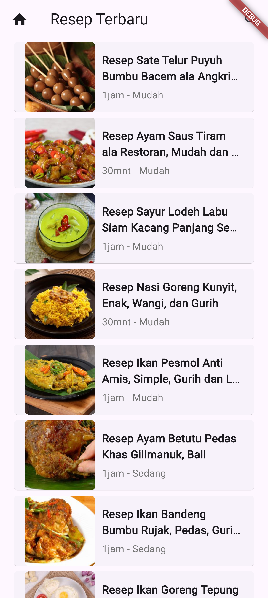
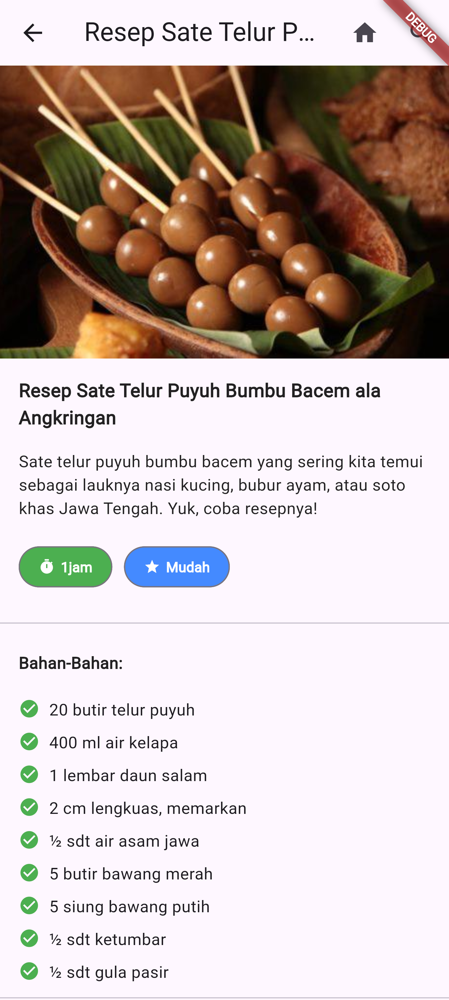

# Resep Masakan Flutter

Aplikasi Flutter ini dirancang untuk memudahkan pengguna dalam menemukan dan mencoba berbagai resep masakan dari seluruh dunia. Dengan tampilan yang user-friendly dan fitur yang lengkap, aplikasi ini memungkinkan pengguna untuk mencari resep berdasarkan nama masakan yang mereka inginkan. Setiap resep dilengkapi dengan daftar bahan-bahan serta instruksi langkah demi langkah yang jelas dan mudah diikuti, sehingga pemula sekalipun dapat mencoba resep tersebut.

## Alat Pengembangan

- Flutter 3.24.2
- Tools • Dart 3.5.2 • DevTools 2.37.2

## Jalankan Program

- `git clone https://github.com/fitri-hy/resep-masakan-flutter.git`
- `cd resep-masakan-flutter`
- `flutter pub get`
- `flutter run`

## Menghasilkan Keystore

```
keytool -genkeypair -v -keystore resep-masakan-key.keystore -keyalg RSA -keysize 2048 -validity 10000 -storepass 220898 -keypass 220898 -alias resep-masakan
```

## Peluncuran

```
flutter build apk --release
flutter build appbundle
```

<div style="display: flex; flex-wrap: wrap;">
  
  
  
  
</div>
