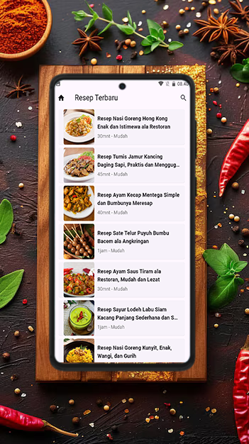
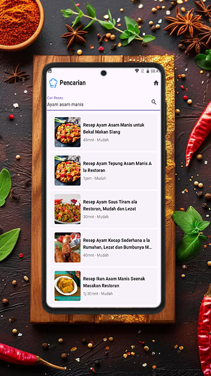
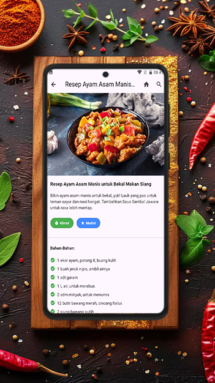

# Resep Masakan Flutter

Flutter application is designed to make it easier for users to find and try various cooking recipes from all over the world. With a user-friendly appearance and complete features, this application allows users to search for recipes based on the name of the dish they want. Each recipe comes with a list of ingredients and step-by-step instructions that are clear and easy to follow, so even beginners can try the recipe.

## Development Tools

- Flutter 3.24.2
- Tools • Dart 3.5.2 • DevTools 2.37.2

## Run Program

- `git clone https://github.com/fitri-hy/resep-masakan-flutter.git`
- `cd resep-masakan-flutter`
- `flutter pub get`
- `flutter run`

## Generates Keystore

```
keytool -genkeypair -v -keystore resep-masakan-key.keystore -keyalg RSA -keysize 2048 -validity 10000 -storepass 220898 -keypass 220898 -alias resep-masakan
```

## Changing Package Name

```
flutter pub global activate rename
flutter pub global run rename --bundleId com.example.newname
```

## Build & Release

```
flutter build apk --release
flutter build appbundle
```

<div style="display: flex; flex-wrap: wrap;">
  
  
  
  
</div>

## Changelog

> ### V1.0.0(2)

- [ADD] AdMob Banner & Interstitial
- AdMob AppID: `android/app/src/main/AndroidManifest.xml`:

```
<meta-data
android:name="com.google.android.gms.ads.APPLICATION_ID"
android:value="ca-app-pub-xxxxxxxxxxxxxxxxxx" />
```
- AdMob bannerIdUnit: `lib/services/AdMobConfig.dart

```
class AdMobConfig {
  static const String bannerAdUnitId = 'ca-app-pub-xxxxxxxxxxxxxxxxxx';
  static const String initInterstitialAd = 'ca-app-pub-xxxxxxxxxxxxxxxxxx';
}
```


> ### V1.0.0(1)

- Release
